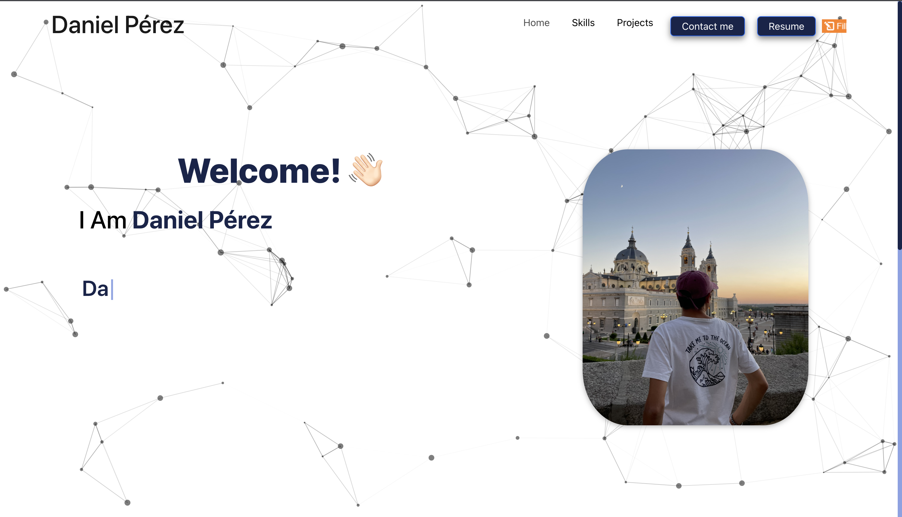

  # React Portfolio 
  
  ## Description
    This is a personal portfolio done with React.js. 
    
   

  ## Table of Contents
  - [Installation](#installation)
  - [Usage](#usage)
  - [License](#license)
  - [Tests](#tests)
  - [Contributors](#contributors)
  - [Details](#details)

  ## Installation
  Packages required to run this program are: You will need node.js and git installed
  
  ## Usage
  Examples of how to use this program: 

  ## License
  MIT

  ## Tests
  To test, run the following command: N/A

  ## Contributors
  danielpsnz

  ## Contact
  
 
  

  
View the project in GitHub at: https://danielpsnz.github.io/PerezSanzDaniel_ReactPortfolio/
  
If you have any questions, contact the author directly at dpdaniperezsanz@gmail.com.
